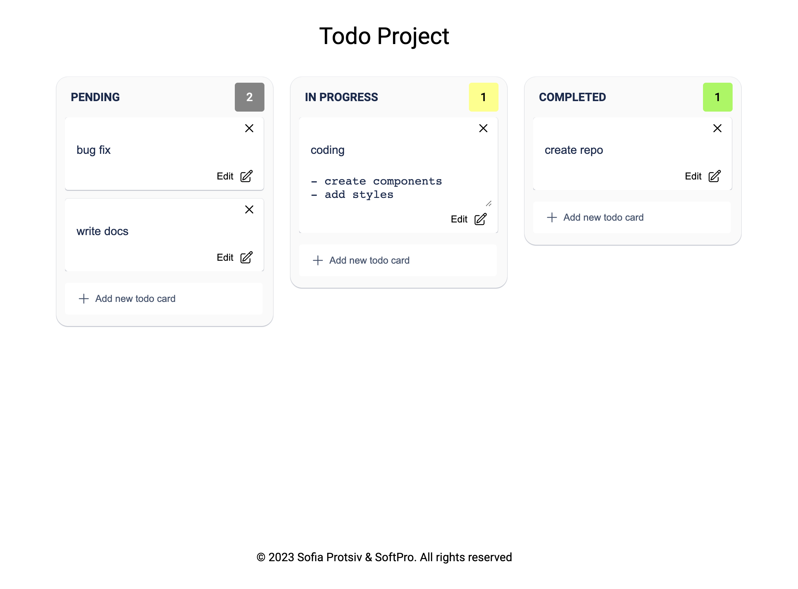
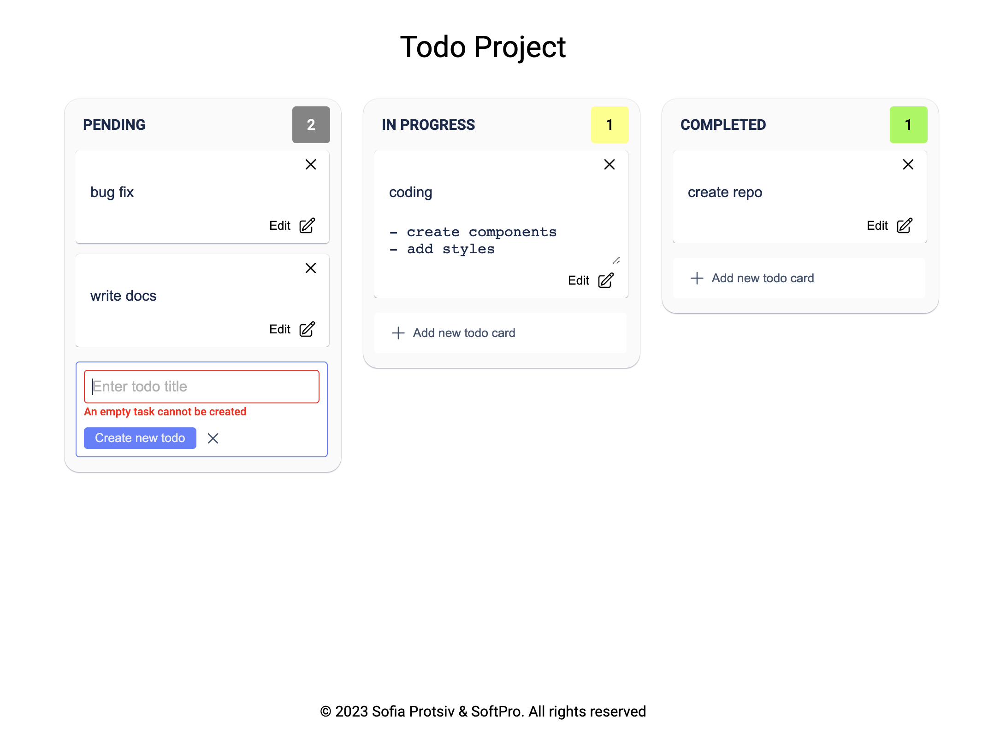
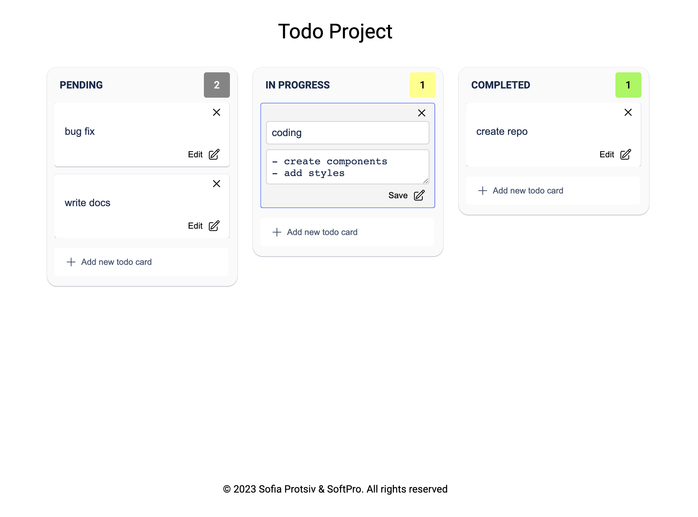

# ToDoList

This is a simple ToDoList application built using HTML, SCSS, JavaScript, Vue.js and Vite. It allows you to manage your tasks effectively. You can add new tasks, mark them as completed, edit existing tasks, and delete tasks. The application also provides statistics regarding completed tasks. If you refresh the page, all your tasks will remain, because the local storage was used to save tasks.



## Installation

1. Clone the repository:

```
git clone [https://github.com/your-username/ToDoList.git](https://github.com/SofiaProtsiv/todolist-project-vue)
```

2. Navigate to the project directory and run:

```
npm i
```

3. Open project localy:
```
npm run dev
```

## Features

- Add tasks by pressing "Enter"
- Error message displayed for empty task submission
- Edit existing tasks
- Delete tasks
- Track statistics for completed tasks
- Ability to move cards between groups by dragging them

## Usage

1. In the input field, enter the task you want to add and press "Enter" to add it to the list.

2. To mark a task as completed, drag the task to a specific "Completed" group, e.g.
3. To edit the task, click the Edit button and edit it. Click the "Save" button to save your changes.

4. To delete a task, click the delete button marked with an "X" next to the task.
5. Each group has statistics, which displays the total number of tasks for a particular group.

## Design

The design of this ToDoList application has been created with a focus on simplicity and ease of use. It features a clean and intuitive user interface to enhance the task management experience.

## Development

To further develop this application, follow these steps:

1. Install dependencies:

```
npm install
```

2. Run the development server:

```
npm run dev
```

3. Make the necessary changes and enhancements to the code according to your requirements.

## Resources

- [Vue.js Documentation](https://vuejs.org/)
- [SCSS Documentation](https://sass-lang.com/documentation)

## Enjoy organizing your tasks with ToDoList!
